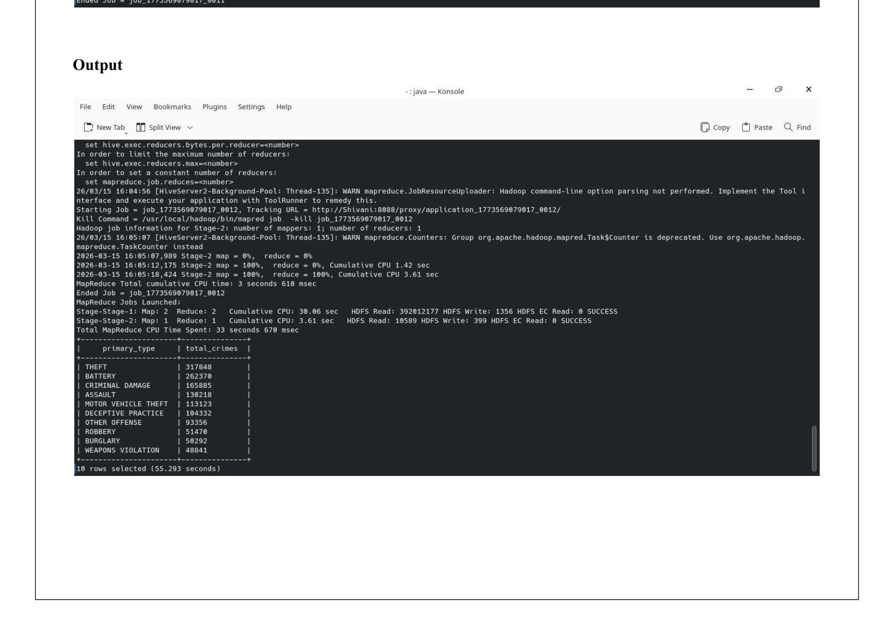
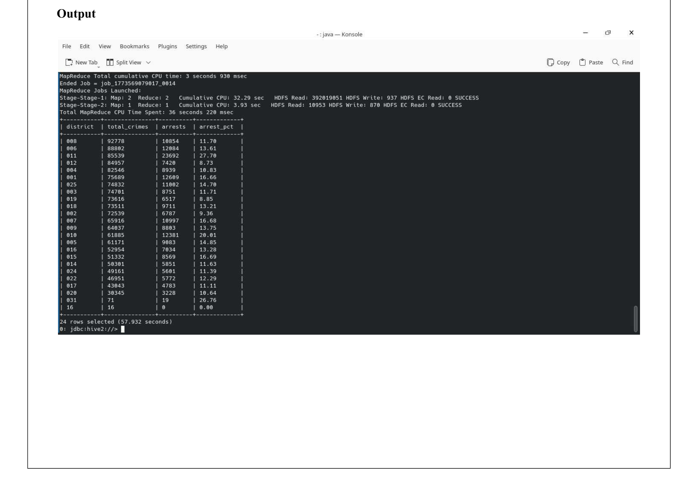
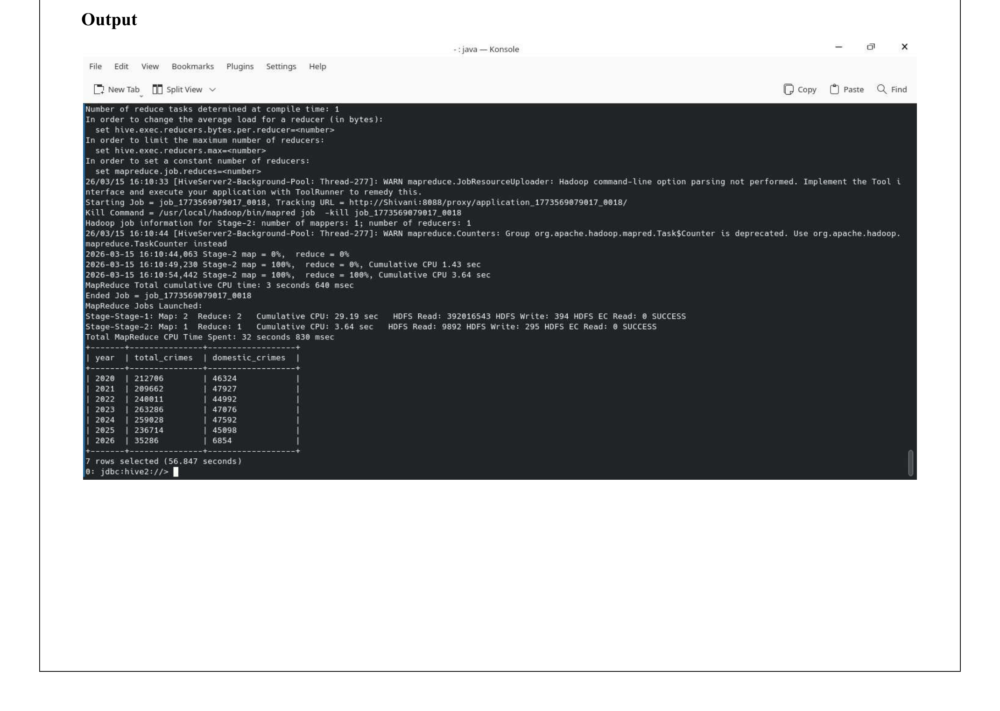

# Chicago Crime Pattern Analysis — Apache Hive

  

## Overview

Runs five HiveQL queries against 1,456,694 Chicago crime records spanning 2020 to 2026, covering the COVID lockdown period through recovery. Surfaces patterns in crime type, district-level arrest rates, time-of-day distribution, year-on-year trends, and high-crime locations.

## Objective

- Load Chicago Crime dataset into Hive using OpenCSVSerde for quoted field handling
- Run 5 analytical queries covering geography, time, and crime type
- Extract actionable insights from 1.4M records using SQL-style syntax on HDFS

## Dataset

Chicago Crime Dataset from the City of Chicago Data Portal.

| Property | Value |
|---|---|
| Records | 1,456,694 |
| Period | 2020 to 2026 |
| Columns | 22 |
| Key fields | primary_type, description, location_desc, arrest, domestic, district, year, crime_date |

## Real-World Use Case

| Scenario | Application |
|---|---|
| Law Enforcement | Allocate patrol resources by district and time of day |
| City Planning | Identify high-crime locations for infrastructure intervention |
| Policy Research | Measure impact of COVID lockdowns on crime trends |
| Public Safety | Build neighbourhood-level risk dashboards |

## Technologies Used

| Technology | Version | Purpose |
|---|---|---|
| Apache Hive | 4.0.1 | SQL-style querying on HDFS |
| Beeline | 4.0.1 | Hive CLI |
| OpenCSVSerde | — | Handle quoted string fields in CSV |
| Apache Hadoop | 3.4.1 | Underlying distributed storage and execution |

## Table Setup

```sql
CREATE TABLE chicago_crimes (
    id STRING, case_number STRING, crime_date STRING,
    block STRING, lucr STRING, primary_type STRING,
    description STRING, location_desc STRING,
    arrest STRING, domestic STRING, beat STRING,
    district STRING, ward STRING, community_area STRING,
    fbi_code STRING, x_coordinate STRING, y_coordinate STRING,
    year STRING, updated_on STRING
)
ROW FORMAT SERDE 'org.apache.hadoop.hive.serde2.OpenCSVSerde'
WITH SERDEPROPERTIES (
    "separatorChar" = ",",
    "quoteChar"     = "\""
)
STORED AS TEXTFILE
TBLPROPERTIES ("skip.header.line.count"="1");
```

OpenCSVSerde is used instead of the default LazySimpleSerDe because crime descriptions contain embedded commas within quoted fields.

## Queries and Results

**Query 1 — Top 10 Crime Types**

Which crimes happen most in Chicago across 2020 to 2026?

```sql
SELECT primary_type, COUNT(*) AS total_crimes
FROM chicago_crimes
WHERE year BETWEEN '2020' AND '2026'
GROUP BY primary_type
ORDER BY total_crimes DESC
LIMIT 10;
```



**Key Insight:** Theft leads with 317,848 incidents, followed by Battery at 262,370. Together they account for nearly 40% of all crimes in the dataset.

---

**Query 2 — District-wise Crime Count and Arrest Rate**

Which districts have the most crime, and how often do arrests follow?

```sql
SELECT district,
    COUNT(*) AS total_crimes,
    SUM(CASE WHEN arrest = 'true' THEN 1 ELSE 0 END) AS arrests,
    ROUND(SUM(CASE WHEN arrest = 'true' THEN 1 ELSE 0 END) * 100.0 / COUNT(*), 2) AS arrest_pct
FROM chicago_crimes
WHERE year BETWEEN '2020' AND '2026'
GROUP BY district
ORDER BY total_crimes DESC;
```



**Key Insight:** District 008 has the highest crime count at 92,778 but only an 11.7% arrest rate, suggesting resource constraints or reporting imbalances in that area.

---

**Query 3 — Time-of-Day Crime Pattern**

When do crimes happen most during the day?

```sql
SELECT
    CASE
        WHEN CAST(SPLIT(SPLIT(crime_date, ' ')[1], ':')[0] AS INT) BETWEEN 0 AND 5 THEN 'Late Night'
        WHEN CAST(SPLIT(SPLIT(crime_date, ' ')[1], ':')[0] AS INT) BETWEEN 6 AND 11 THEN 'Morning'
        WHEN CAST(SPLIT(SPLIT(crime_date, ' ')[1], ':')[0] AS INT) BETWEEN 12 AND 17 THEN 'Afternoon'
        ELSE 'Evening'
    END AS time_slot,
    COUNT(*) AS total_crimes
FROM chicago_crimes
WHERE year BETWEEN '2020' AND '2026'
GROUP BY ...
ORDER BY total_crimes DESC;
```


**Key Insight:** Morning hours (6am to 12pm) account for the highest crime volume at 716,415, likely driven by commuter theft and street crime during peak transit hours.

---

**Query 4 — Year-wise Crime Trend with Domestic Crimes**

How did crime volumes shift from 2020 to 2026? How many involved domestic incidents?

```sql
SELECT year, COUNT(*) AS total_crimes,
    SUM(CASE WHEN domestic = 'true' THEN 1 ELSE 0 END) AS domestic_crimes
FROM chicago_crimes
WHERE year BETWEEN '2020' AND '2026'
GROUP BY year
ORDER BY year;
```



**Key Insight:** Crime dipped in 2021 during COVID restrictions then rebounded sharply in 2022. Domestic crimes remain consistently around 46,000 to 48,000 per year regardless of overall crime trends.

---

**Query 5 — Top 10 Crime Locations**

Where in the city do crimes most commonly occur?

```sql
SELECT location_desc, COUNT(*) AS total_crimes
FROM chicago_crimes
WHERE year BETWEEN '2020' AND '2026'
GROUP BY location_desc
ORDER BY total_crimes DESC
LIMIT 10;
```


**Key Insight:** Streets account for 389,129 incidents, nearly 1.4x more than the second highest location (Apartment at 279,588), confirming that public outdoor spaces are the primary crime environment.

## Run

```bash
start-dfs.sh && start-yarn.sh

hdfs dfs -mkdir -p /chicago/crimes
hdfs dfs -put Crimes.csv /chicago/crimes/

hive -f hive_queries.sql
```

## Scalability

| Scale | Approach |
|---|---|
| 1.4M records (current) | Single-node Hive on local HDFS |
| 50M records | Multi-node cluster, ORC file format for compression |
| Real-time ingestion | Replace batch load with Kafka + Hive streaming |
