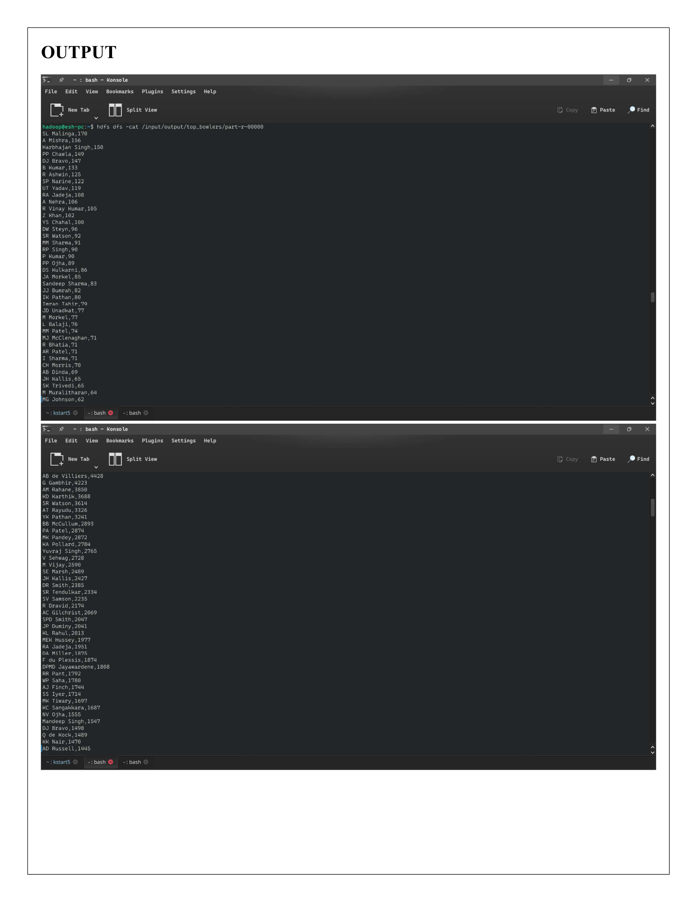

# IPL Cricket Data Analysis — Apache Pig

  

## Overview

Analyses 16 seasons of IPL data using Apache Pig. Loads match-level and ball-by-ball delivery data from HDFS and extracts six insights covering team performance, player records, and toss strategy entirely in Pig Latin.

## Objective

- Load IPL matches and deliveries data from HDFS
- Run 6 analytical queries using Pig Latin relational operators
- Store results back to HDFS for downstream consumption

## Dataset

| File | Description | Key Columns |
|---|---|---|
| matches.csv | One row per IPL match | season, team1, team2, toss_winner, winner, player_of_match |
| deliveries.csv | One row per ball bowled | batsman, bowler, batsman_runs, dismissal_kind |

## Real-World Use Case

| Scenario | Application |
|---|---|
| Sports Analytics | Team and player performance benchmarking |
| Broadcasting | Real-time stats pipeline for commentary |
| Fantasy Sports | Historical form data for player selection models |
| Coaching Staff | Identify opposition weaknesses from delivery data |

## Technologies Used

| Technology | Version | Purpose |
|---|---|---|
| Apache Pig | 0.17 | Data flow scripting on Hadoop |
| Apache Hadoop | 3.4.1 | Distributed execution |
| HDFS | 3.4.1 | Input and output storage |
| PigStorage | — | CSV serialisation/deserialisation |

## Analyses

| Analysis | Question Answered |
|---|---|
| Matches per season | How many games were played each year? |
| Team win count | Which franchises have won the most matches all-time? |
| Toss impact | Does winning the toss actually help you win the match? |
| Player of the Match | Who has won the most MOM awards across all seasons? |
| Top batsmen | Who are the highest run-scorers in IPL history? |
| Top bowlers | Who has taken the most wickets? (run outs excluded) |

## Architecture

```
+------------------------------------------+
|  matches.csv + deliveries.csv (HDFS)     |
+------------------+-----------------------+
                   | LOAD via PigStorage(',')
                   v
+------------------------------------------+
|  FILTER / GROUP / FOREACH / ORDER        |
|  (Pig Latin relational operators)        |
+------------------+-----------------------+
                   | DUMP to console
                   v
+------------------------------------------+
|  STORE results to HDFS output paths      |
+------------------------------------------+
```

## Code Explanation

**Loading data with schema**
```pig
match = LOAD 'hdfs://localhost:9000/input/matches.csv'
    USING PigStorage(',')
    AS (id:int, season:int, ..., winner:chararray, ...);
```

**Team win count**
```pig
wins_only = FILTER match BY winner != '' AND winner != 'NA';
grp2 = GROUP wins_only BY winner;
team_wins = FOREACH grp2 GENERATE group AS team, COUNT(wins_only) AS wins;
team_wins_sorted = ORDER team_wins BY wins DESC;
DUMP team_wins_sorted;
```

**Top bowlers (excluding run outs)**
```pig
wkts = FILTER deliveries BY
    player_dismissed != '' AND player_dismissed != 'NA'
    AND dismissal_kind != 'run out'
    AND dismissal_kind != 'retired hurt';
grp6 = GROUP wkts BY bowler;
wickets = FOREACH grp6 GENERATE group AS bowler, COUNT(wkts) AS wickets;
wickets_sorted = ORDER wickets BY wickets DESC;
DUMP wickets_sorted;
```

## Output (actual results from HDFS)



## Run

```bash
start-dfs.sh && start-yarn.sh

hdfs dfs -mkdir -p /input
hdfs dfs -put matches.csv deliveries.csv /input/

pig -f ipl_analysis.pig
```

## Results stored in HDFS

```
/input/output/team_wins
/input/output/top_batsmen
/input/output/top_bowlers
/input/output/top_pom
```

## Scalability

| Scale | Approach |
|---|---|
| 16 seasons (demo) | Single-node Pig on local HDFS |
| Full historical data | Multi-node cluster, Pig parallelism tuning |
| Real-time updates | Replace batch Pig with Spark Streaming |
