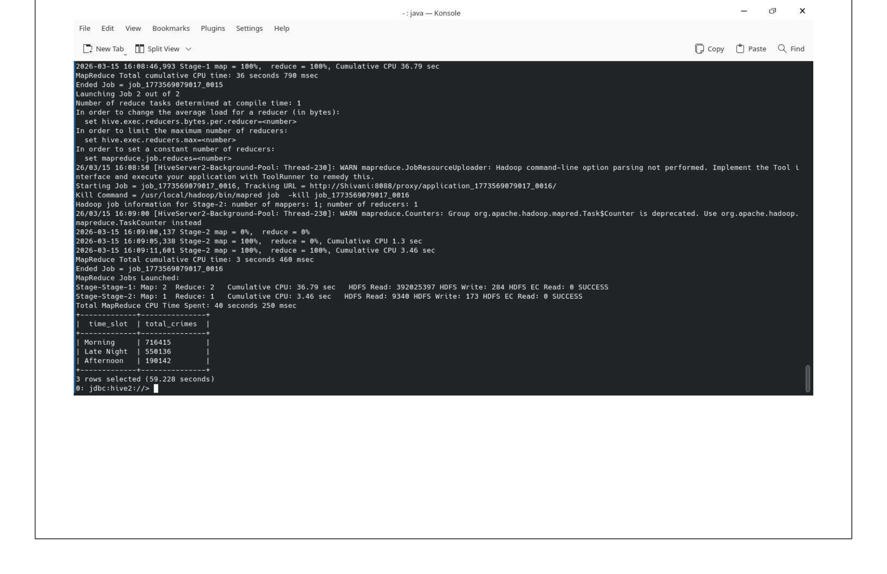
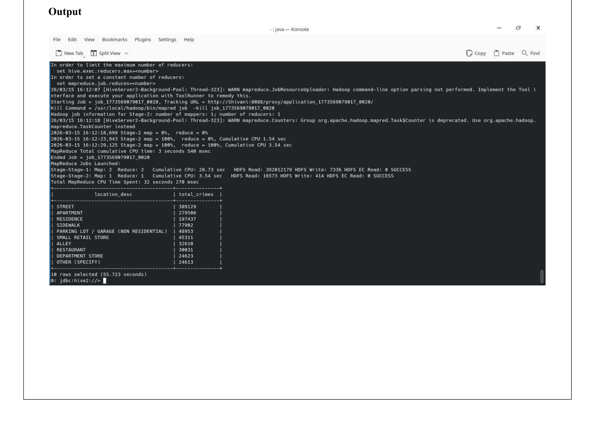

# hive-chicago-crimes

Explores 1.4 million Chicago crime records (2020–2026) using Apache Hive. Five queries uncover crime patterns by type, district, time of day, year, and location.

## Files

- `hive_queries.sql` — table creation, data loading, and 5 analytical queries
- `hive_q1_output.png` through `hive_q5_output.png` — actual output from Hive

## Dataset

Chicago Crime Dataset — 1,456,694 records, 2020–2026.

Loaded using OpenCSVSerde to handle quoted fields:
```sql
ROW FORMAT SERDE 'org.apache.hadoop.hive.serde2.OpenCSVSerde'
WITH SERDEPROPERTIES ("separatorChar" = ",", "quoteChar" = "\"")
```

## Queries & Outputs

**Q1 — Top 10 Crime Types**


**Q2 — District-wise Crime & Arrest Rate**


**Q3 — Time-of-Day Pattern**


**Q4 — Year-wise Crime Trend with Domestic Crimes**


**Q5 — Top 10 Crime Locations**


## Run

```bash
hive -f hive_queries.sql
```
